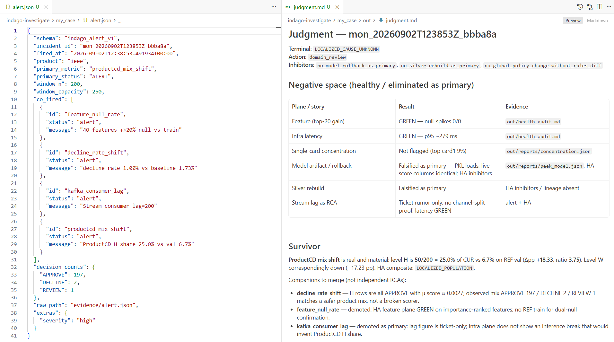

# INDAGO

**Offline investigation for ML / risk decision-system incidents** on a frozen evidence pack: bind columns via Views, run a plane-wise health audit, eliminate competing stories, and close with inhibitors plus an action class — before reliable labels arrive.

Python **3.12+** · pip / uv · Apache-2.0 · [dmsavkov/indago-investigate](https://github.com/dmsavkov/indago-investigate)  
Topics: `investigation` · `mlops` · `decision-systems` · `model-monitoring` · `python`

[▶ Demo video](https://github.com/dmsavkov/indago-investigate/releases/download/demo-media/indago-demo.mp4) · [Alert ‖ judgment](#example)

---

## The problem

Production ML and risk systems emit many signals: feature or label drift, failing cohorts, train–serve skew, score shifts, null spikes, approval-rate changes, rule diffs, configuration or baseline mismatch. An alert says *something* changed. It does not say whether the change is real degradation, expected mix shift, a serving bug, a policy change, or not enough evidence to say — or what you should **not** do next (for example, roll back a healthy model).

INDAGO targets that middle step: **investigation under incomplete evidence**, especially before labels. Completeness means an honest status vector across decision-system planes — including **UNKNOWN** — plus competing hypotheses you can falsify, not a forced single root cause. Disposition, **inhibitors**, and next action class are first-class outcomes.

**Not these:** not a finished fully autonomous closer; not a monitoring product by itself; not “run a checklist of checks” without judgment and inhibitors; not a real-time authorizer, L1 case UI, auto-retrain, or magic on an unlabeled lake with no map.

---

## Minimal pack

| Required | Optional |
|----------|----------|
| Alert / KPI (JSON or short text) | Rules snapshot |
| CUR window (parquet/csv) | Labels / light infra metrics |
| REF window (parquet/csv) | `org-docs/` (vocabulary notes only) |
| **Trained model** (joblib/PKL) | — |
| Column roles via Views | — |

Layout: `evidence/live|ref/{data,models,rules}/`. Tools consume **Views**, not vendor JSON shapes.

- **Demo** — [`examples/demo_case/`](examples/demo_case/): synthetic CUR/REF + model + pre-bound Views + `agent-instructions/`.
- **Template** — [`examples/minimal_template/`](examples/minimal_template/): empty evidence dirs + full `agent-instructions/` kit.

Checklist: [`docs/minimal-pack.md`](docs/minimal-pack.md).

---

## Start

### Install

```bash
# from this package directory (clone of indago-investigate)
uv sync --extra score
# or: pip install -e ".[score]"
```

### Quick start (demo)

```bash
indago-catalog examples/demo_case
# → out/catalog.md + catalog.json (present files on disk)

indago-health-audit examples/demo_case --no-plots
# → out/health_audit.md + .json (plane statuses; UNKNOWN allowed)

indago-investigate validate-views examples/demo_case
# → critique + out/reports/validate_views.*

indago-investigate slice-summary examples/demo_case --key entity_id
# → out/reports/slice_summary.json

indago-investigate topk-importance examples/demo_case \
  --model-path evidence/live/models/champion.pkl
# → out/reports/topk_importance.json
```

Default bind is Views-required (`INDAGO_BIND=views`). Optional env: [`.env.example`](.env.example).

### Try an investigation on the demo

Attach / open the case protocol (host: paste ACTIVATION), then run the loop from there:

```text
# Open the case protocol (host: attach this folder / paste ACTIVATION)
#   examples/demo_case/agent-instructions/README.md
```

### Your own pack

```bash
cp -r examples/minimal_template my_case
# add CUR/REF under evidence/live|ref/data/, model under evidence/live/models/
# edit my_case/alert.json
# open my_case/agent-instructions/README.md (then ACTIVATION.md)
indago-catalog my_case
# peek-frame → author out/views/ → validate-views → health-audit → …
```

The template already contains `agent-instructions/` (protocol, claim tags, View examples). You do not need a shared docs mount.

---

## How it works

1. **Inventory** — `indago-catalog` lists what is on disk.  
2. **Bind** — author View sidecars under `out/views/` (paths + `column_roles`); `validate-views`.  
3. **Orient** — `indago-health-audit` (path-only Views → partial audit + loud missings).  
4. **Discriminate** — L1/L2 tools where survivors need them.  
5. **Close** — `out/judgment.md` + `out/judgment_struct.json`; `validate-judgment`.

### Case layout

```text
my_case/
  alert.json
  evidence/live|ref/{data,models,rules}/
  agent-instructions/     # protocol SoT for this case
  org-docs/               # optional
  out/
    catalog.*
    views/                # you author
    health_audit.*
    reports/              # tool JSON (+ critiques)
    judgment.md
    judgment_struct.json
```

---

## Example



https://github.com/dmsavkov/indago-investigate/releases/download/demo-media/indago-demo.mp4

Full ledgers are long by design. On the demo, expect honest UNKNOWNs where optional evidence is absent — that is success, not failure.

---

## Feedback

- [GitHub Issues](https://github.com/dmsavkov/indago-investigate/issues)
- Telegram: [@dmsavkov](https://t.me/dmsavkov)
- Thin sanitized packs and design-partner walkthroughs welcome — we do not need your warehouse

---

## License

Copyright 2026 Dmitry Savkov. Licensed under the [Apache License 2.0](LICENSE).
